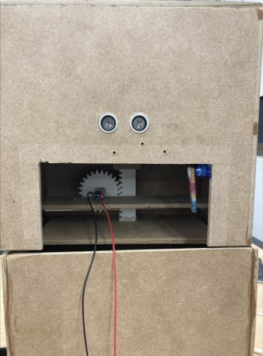
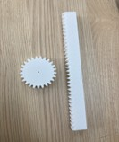
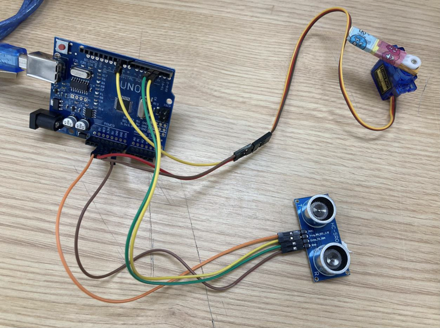
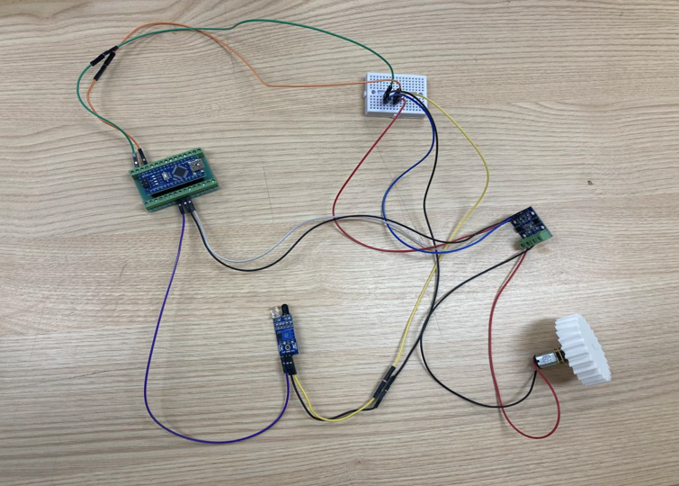

# Smart TrashBin

초음파 센서 기반 자동 개폐 기능과 적외선 센서 기반 압축 기능을 구현한 스마트 쓰레기통 프로젝트

## 프로젝트 개요

교내 쓰레기통 포화 문제를 해결하기 위해 개발한 스마트 쓰레기통 시스템입니다.

## Project Document

프로젝트 기획 및 문제 분석 문서

- [Project Planning](./Smart_TrashBin_Project_Planning.pdf)

## 개발 환경

- Arduino Uno
- Ultrasonic Sensor
- Infrared Sensor
- Servo Motor
- DC Motor

## 주요 기능

### 1. 자동 개폐 기능
- 초음파 센서를 이용한 사용자 접근 감지
- 서보모터를 활용한 뚜껑 자동 개폐

### 2. 쓰레기 투입 감지 기능
- 적외선 센서를 이용한 쓰레기 투입 여부 감지
- 투입 여부에 따른 압축 동작 조건 판단

### 3. 압축 기능
- 적외선 센서를 활용한 쓰레기 투입 감지
- 모터와 기어를 이용한 쓰레기 압축

## 트러블슈팅

### 1. 적외선 센서 오인식으로 인한 반복 압축 문제 해결
- 적외선 센서가 여러 번 감지된 경우에만 압축 기능이 실행되도록 개선

### 2. 문제 분석을 통한 핵심 기능 도출
- 교내 쓰레기 문제를 분석하여 쓰레기통 포화를 핵심 문제로 정의
- 압축 기능과 자동 개폐 기능을 주요 기능으로 선정

## Source Code

### ultrasonic_sensor_servo_control.ino
- 초음파 센서를 이용한 사용자 접근 감지
- 서보모터를 활용한 자동 개폐 기능 구현

### infrared_sensor_motor_control.ino
- 적외선 센서를 이용한 쓰레기 투입 감지
- 모터 및 기어 구조를 활용한 압축 기능 구현

## Prototype

## Gear Structure

## Circuit

### Ultrasonic Sensor Circuit

### Infrared Sensor Circuit

